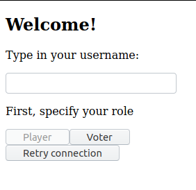
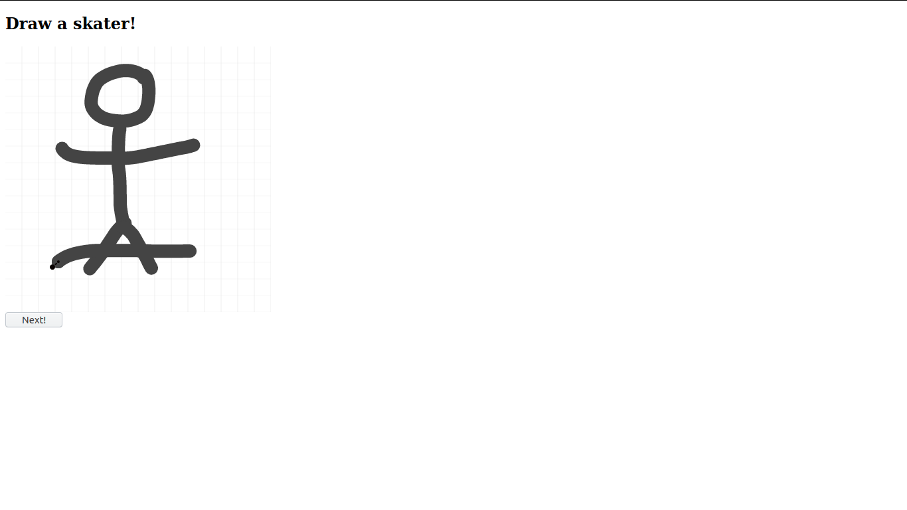
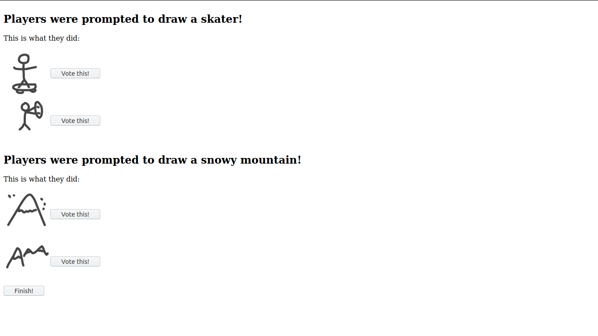
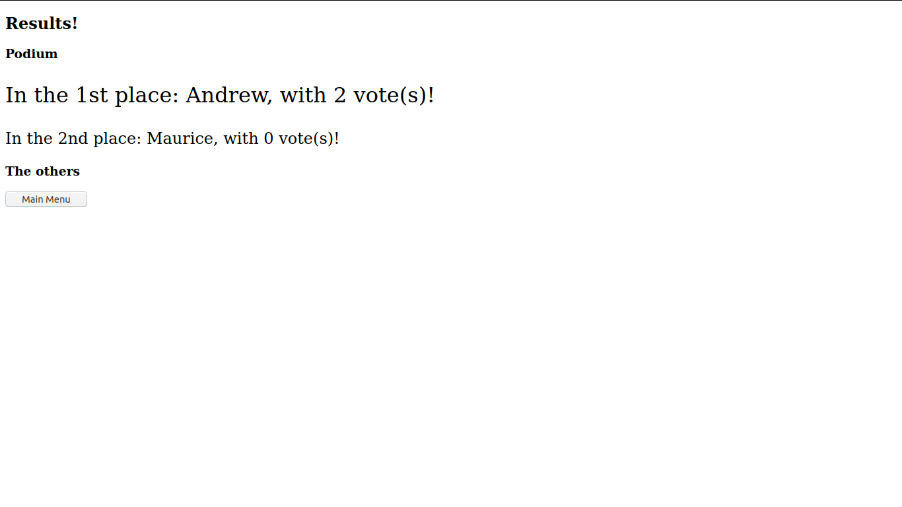

## JS Drawing Game (Still thinking of a good name)

*Who will be the best artist?*

How about you draw some random stuff and let your friends judge you?
Sounds good, doesn't it?

That's what this game is all about. Draw with your friends, then get
judged by your other friends.

## Screenshots

## How to run it?

First, you need to get the server running. Go at
[https://github.com/murilobnt/js-drawing-game-server](https://github.com/murilobnt/js-drawing-game-server),
fetch the server. Once with the server, you might want to run:

### `npm install`

And then:

### `npm start`

If the server is up and listening at the port 30000, you might want to get
this application running with:

### `npm start`

### License

JS Drawing Game is licensed under the [GNU Lesser General Public License v3.0](https://github.com/murilobnt/js-drawing-game/blob/master/LICENSE).

JS Drawing Game Server is licensed under the [GNU Lesser General Public License v3.0](https://github.com/murilobnt/js-drawing-game-server/blob/master/LICENSE).
